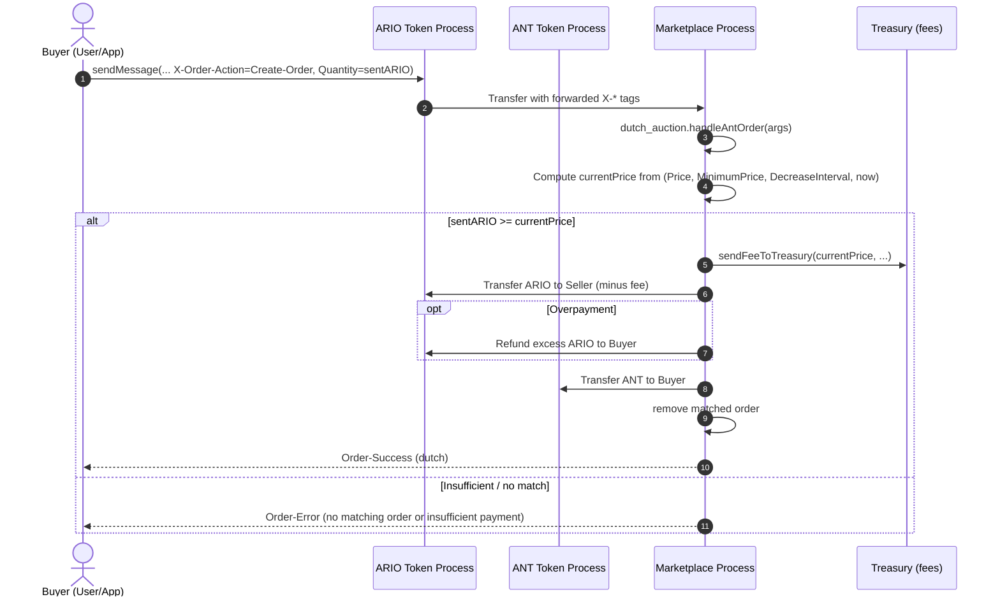

## Buy Now: Dutch Auction

```mermaid
sequenceDiagram
    autonumber
    actor Buyer as Buyer (User/App)
    participant ARIO as ARIO Token Process
    participant ANT as ANT Token Process
    participant Market as Marketplace Process
    participant Treasury as Treasury (fees)

    Buyer->>ARIO: sendMessage(... X-Order-Action=Create-Order, Quantity=sentARIO)
    ARIO->>Market: Transfer with forwarded X-* tags

    Market->>Market: dutch_auction.handleAntOrder(args)
    Market->>Market: Compute currentPrice from (Price, MinimumPrice, DecreaseInterval, now)
    alt sentARIO >= currentPrice
        Market->>Treasury: sendFeeToTreasury(currentPrice, ...)
        Market->>ARIO: Transfer ARIO to Seller (minus fee)
        opt Overpayment
            Market->>ARIO: Refund excess ARIO to Buyer
        end
        Market->>ANT: Transfer ANT to Buyer
        Market->>Market: remove matched order
        Market-->>Buyer: Order-Success (dutch)
    else Insufficient / no match
        Market-->>Buyer: Order-Error (no matching order or insufficient payment)
    end
```

