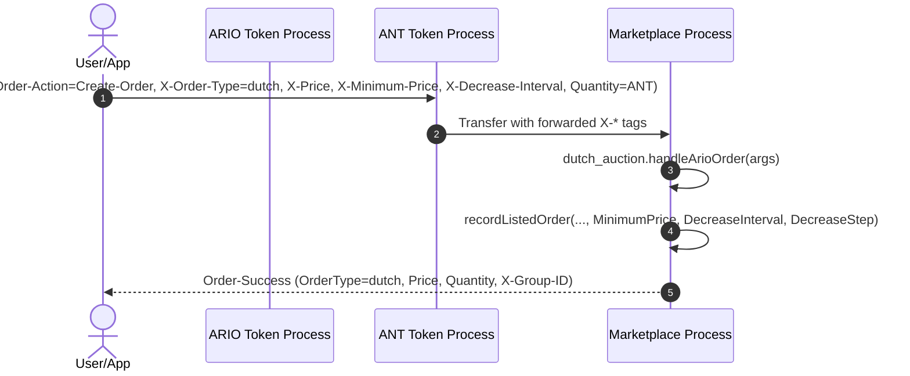

## Listing: Dutch Auction (ARIO-dominant)

```mermaid
sequenceDiagram
    autonumber
    actor User as User/App
    participant ARIO as ARIO Token Process
    participant ANT as ANT Token Process
    participant Market as Marketplace Process

    User->>ANT: sendMessage(... X-Order-Action=Create-Order, X-Order-Type=dutch, X-Price, X-Minimum-Price, X-Decrease-Interval, Quantity=ANT)
    ANT->>Market: Transfer with forwarded X-* tags

    Market->>Market: dutch_auction.handleArioOrder(args)
    Market->>Market: recordListedOrder(..., MinimumPrice, DecreaseInterval, DecreaseStep)
    Market-->>User: Order-Success (OrderType=dutch, Price, Quantity, X-Group-ID)
```

