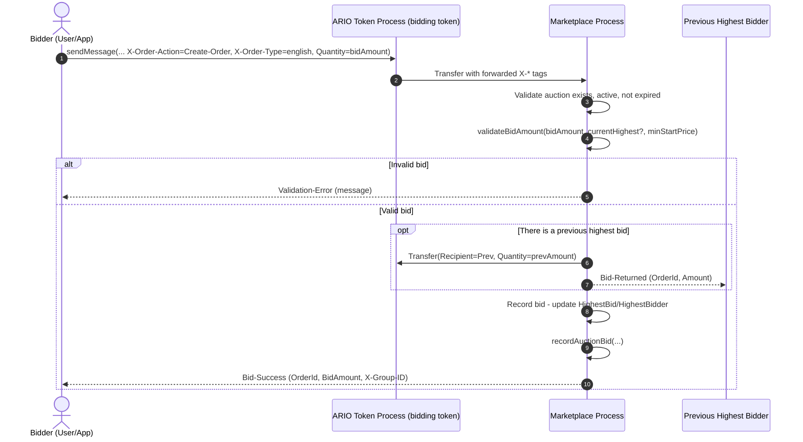

## English Auction Bidding (with refund to previous highest bidder)

```mermaid
sequenceDiagram
    autonumber
    actor Bidder as Bidder (User/App)
    participant ARIO as ARIO Token Process (bidding token)
    participant Market as Marketplace Process
    participant Prev as Previous Highest Bidder

    Bidder->>ARIO: sendMessage(... X-Order-Action=Create-Order, X-Order-Type=english, Quantity=bidAmount)
    ARIO->>Market: Transfer with forwarded X-* tags

    Market->>Market: Validate auction exists, active, not expired
    Market->>Market: validateBidAmount(bidAmount, currentHighest?, minStartPrice)
    alt Invalid bid
        Market-->>Bidder: Validation-Error (message)
    else Valid bid
        opt There is a previous highest bid
            Market->>ARIO: Transfer(Recipient=Prev, Quantity=prevAmount)
            Market-->>Prev: Bid-Returned (OrderId, Amount)
        end
        Market->>Market: Record bid - update HighestBid/HighestBidder
        Market->>Market: recordAuctionBid(...)
        Market-->>Bidder: Bid-Success (OrderId, BidAmount, X-Group-ID)
    end
```

