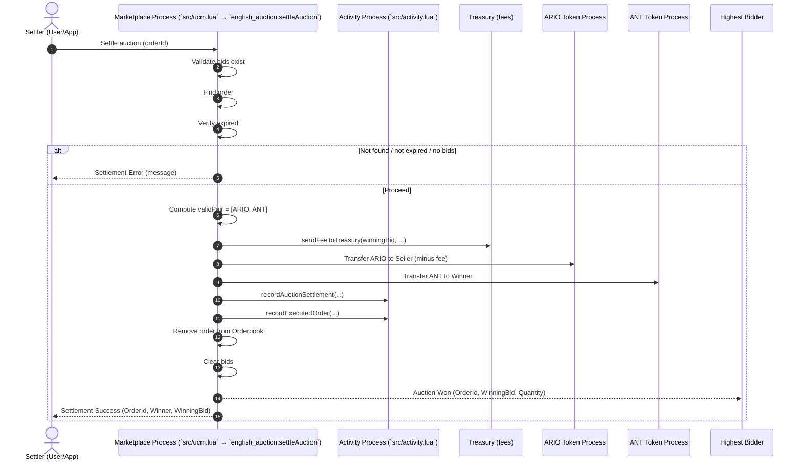

## English Auction Settlement

```mermaid
sequenceDiagram
    autonumber
    actor Settler as Settler (User/App)
    participant Market as Marketplace Process (`src/ucm.lua` → `english_auction.settleAuction`)
    participant Activity as Activity Process (`src/activity.lua`)
    participant Treasury as Treasury (fees)
    participant ARIO as ARIO Token Process
    participant ANT as ANT Token Process
    participant Winner as Highest Bidder

    Settler->>Market: Settle auction (orderId)
    Market->>Market: Validate bids exist
    Market->>Market: Find order
    Market->>Market: Verify expired
    alt Not found / not expired / no bids
        Market-->>Settler: Settlement-Error (message)
    else Proceed
        Market->>Market: Compute validPair = [ARIO, ANT]
        Market->>Treasury: sendFeeToTreasury(winningBid, ...)
        Market->>ARIO: Transfer ARIO to Seller (minus fee)
        Market->>ANT: Transfer ANT to Winner
        Market->>Activity: recordAuctionSettlement(...)
        Market->>Activity: recordExecutedOrder(...)
        Market->>Market: Remove order from Orderbook
        Market->>Market: Clear bids
        Market-->>Winner: Auction-Won (OrderId, WinningBid, Quantity)
        Market-->>Settler: Settlement-Success (OrderId, Winner, WinningBid)
    end
```

