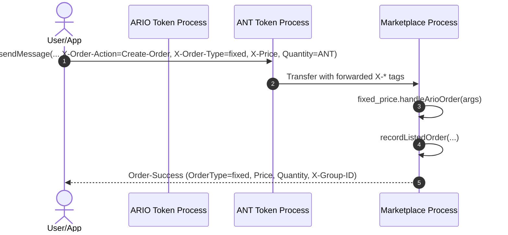

## Listing: Fixed Price (ARIO-dominant)

```mermaid
sequenceDiagram
    autonumber
    actor User as User/App
    participant ARIO as ARIO Token Process
    participant ANT as ANT Token Process
    participant Market as Marketplace Process

    User->>ANT: sendMessage(... X-Order-Action=Create-Order, X-Order-Type=fixed, X-Price, Quantity=ANT)
    ANT->>Market: Transfer with forwarded X-* tags

    Market->>Market: fixed_price.handleArioOrder(args)
    Market->>Market: recordListedOrder(...)
    Market-->>User: Order-Success (OrderType=fixed, Price, Quantity, X-Group-ID)
```

