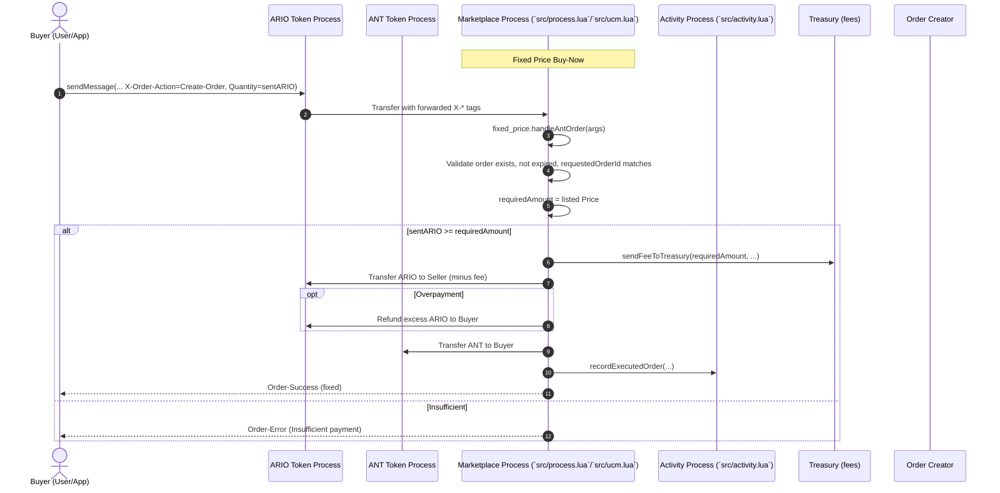

## Buy Now: Fixed Price

```mermaid
sequenceDiagram
    autonumber
    actor Buyer as Buyer (User/App)
    participant ARIO as ARIO Token Process
    participant ANT as ANT Token Process
    participant Market as Marketplace Process (`src/process.lua`/`src/ucm.lua`)
    participant Activity as Activity Process (`src/activity.lua`)
    participant Treasury as Treasury (fees)
    participant Seller as Order Creator

    rect rgba(230,255,230,0.25)
    Note over Market: Fixed Price Buy-Now
    end

    Buyer->>ARIO: sendMessage(... X-Order-Action=Create-Order, Quantity=sentARIO)
    ARIO->>Market: Transfer with forwarded X-* tags

    Market->>Market: fixed_price.handleAntOrder(args)
    Market->>Market: Validate order exists, not expired, requestedOrderId matches
    Market->>Market: requiredAmount = listed Price
    alt sentARIO >= requiredAmount
        Market->>Treasury: sendFeeToTreasury(requiredAmount, ...)
        Market->>ARIO: Transfer ARIO to Seller (minus fee)
        opt Overpayment
            Market->>ARIO: Refund excess ARIO to Buyer
        end
        Market->>ANT: Transfer ANT to Buyer
        Market->>Activity: recordExecutedOrder(...)
        Market-->>Buyer: Order-Success (fixed)
    else Insufficient
        Market-->>Buyer: Order-Error (Insufficient payment)
    end
```

