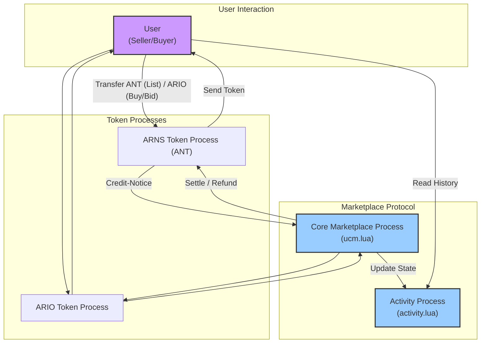
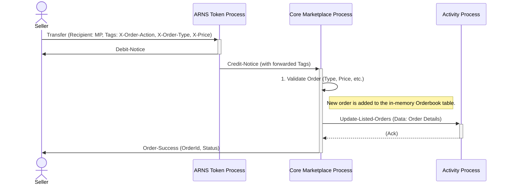
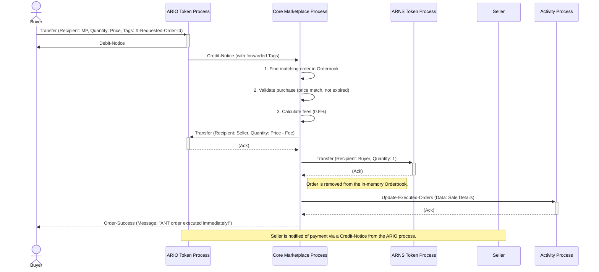

# ARnS Marketplace Specification

## 1. Introduction

The **ARnS Marketplace** is a decentralized protocol built on Arweave's AO computer. It facilitates the trustless exchange of ARnS (Arweave Name Service) tokens using a decentralized order book system. These ARnS tokens, unique digital assets representing permaweb domain names, are referred to generically as "ANTs" (Arweave Name Tokens) within the protocol.

This specification details the marketplace's architecture, core components, data structures, and functionality, including order creation, matching, and settlement for various sale types.

---

## 2. Key Components & Architecture

The marketplace operates using a two-process architecture to separate live trade execution from historical data querying, ensuring both performance and reliability.

1.  **Core Marketplace Process (`ucm.lua`)**: The central engine that manages the live `Orderbook`, validates transactions, executes trades, and handles all state changes. It is the only process that can write to the `Activity Process`.

2.  **Activity Process (`activity.lua`)**: A historical ledger and query engine. It stores a permanent record of all marketplace events (listings, sales, cancellations, bids) and provides a rich, read-only API for clients and UIs to fetch data with filtering, sorting, and pagination.

3.  **ARNS Tokens (ANTs)**: The unique assets being traded. Each ARNS token is its own process on AO. When listed for sale, ownership of the token's process is transferred to the Core Marketplace Process, which acts as an escrow.

4.  **ARIO Token (`ARIO_TOKEN_PROCESS_ID`)**: The primary currency for trades. All prices, bids, and fees are denominated in ARIO. The specification requires that every trade pair must involve ARIO.

### Component Interaction Diagram

This diagram illustrates how the different components of the ARnS ecosystem interact with the marketplace protocol.



---

## 3. Core Data Structures

#### 3.1 Order Book
The `Orderbook` is the live state of all active listings, managed by the Core Marketplace Process.

```lua
Orderbook = {
    {
        Pair = { "ANT_Token_Process_ID", "ARIO_Token_Process_ID" },
        Orders = {
            -- Order object, see below
        }
    },
    -- ... more pairs
}
```

#### 3.2 Order
An `Order` represents a single listing for an ARNS token. Its structure expands to accommodate different sale types.

```lua
-- Base Order Fields
Order = {
    Id = "message-id-of-the-listing-tx",
    Creator = "seller-profile-or-wallet-id",
    Quantity = "1", -- Always 1 for ARNS tokens
    Token = "ANT_Token_Process_ID",
    DateCreated = "unix-timestamp-ms",
    OrderType = "'fixed' or 'dutch' or 'english'",
    Price = "starting-price-in-ario-units",
    ExpirationTime = "unix-timestamp-ms", -- Optional, auction ends if not settled

    -- Dutch Auction Fields
    MinimumPrice = "minimum-price-in-ario-units",
    DecreaseInterval = "duration-in-ms",
    DecreaseStep = "calculated-price-decrease-per-interval",

    -- English Auction Bids (Managed in a separate state table)
    EnglishAuctionBids = {
        [OrderId] = {
            Bids = { { Bidder, Amount, Timestamp } },
            HighestBid = "amount-in-ario-units",
            HighestBidder = "bidder-profile-or-wallet-id"
        }
    }
}
```

---

## 4. Order Types

The marketplace supports three distinct types of sales, specified by the `X-Order-Type` tag during order creation.

#### 4.1 Fixed Price (`fixed`)
A standard "buy now" sale. The ARNS token is listed at a static price. A buyer can purchase it at any time by sending the exact price in ARIO.

#### 4.2 Dutch Auction (`dutch`)
An auction where the price starts high and decreases linearly over time until it reaches a minimum price or is purchased.
-   **Parameters:** `Price` (starting), `MinimumPrice`, `ExpirationTime`, `DecreaseInterval`.
-   **Execution:** A buyer can purchase the token at any time. The sale price is calculated based on the time elapsed since the auction started. The first buyer to send sufficient ARIO wins.

#### 4.3 English Auction (`english`)
A traditional auction where participants place increasingly higher bids.
-   **Parameters:** `Price` (starting/reserve), `ExpirationTime`.
-   **Bidding:** Bidders transfer ARIO to the marketplace. Each new bid must be higher than the current highest bid. When a new high bid is placed, the previous high bidder's ARIO is automatically refunded.
-   **Settlement:** After the `ExpirationTime` has passed, anyone can trigger the `Settle-Auction` action. The marketplace then executes the final trade, transferring the ARNS token to the highest bidder and the winning bid amount to the seller.

---

## 5. Functions & Handlers

Interaction with the marketplace is primarily driven by sending messages with specific `Action` tags to the Core Marketplace Process.

#### 5.1 `Credit-Notice` (via Token Transfer)
This is the main entry point for creating listings, purchasing tokens, and placing bids. A user initiates this by transferring a token (either an ARNS token or ARIO) to the Core Marketplace Process.

-   **Action:** Listing an ARNS Token
    -   **Token Transferred:** ARNS Token Process.
    -   **Required Tags:** `X-Order-Action: Create-Order`, `X-Swap-Token` (ARIO process), `X-Order-Type`, `X-Price`. Additional tags for auctions (`X-Expiration-Time`, etc.).
    -   **Outcome:** A new order is validated and added to the `Orderbook`. The Activity Process is notified.

-   **Action:** Purchasing a Token or Placing a Bid
    -   **Token Transferred:** ARIO.
    -   **Required Tags:** `X-Order-Action: Create-Order`, `X-Swap-Token` (ARNS process), `X-Requested-Order-Id` (the ID of the listing to buy/bid on).
    -   **Outcome:** The corresponding logic for the order type is executed (e.g., immediate purchase, bid placement).

#### 5.2 `Cancel-Order`
Allows the original creator of a listing to cancel it and reclaim their token.

-   **Checks:**
    -   Verifies the sender is the original `Creator` of the order.
    -   Fails if the order is not in an 'active' or 'expired' state.
    -   **Crucially, an English auction cannot be cancelled if it has received any bids.**
-   **Outcome:** The order is removed from the `Orderbook`, the ARNS token is transferred back to the sender, and the Activity Process is notified.

#### 5.3 `Settle-Auction`
Finalizes an expired English auction that has at least one bid.

-   **Checks:**
    -   Verifies via the Activity Process that the auction is expired and has a winning bidder (status is `ready-for-settlement`).
-   **Outcome:** The final token swap is executed between the seller and the highest bidder. The order is removed from the `Orderbook`, and the Activity Process is notified of the execution.

---

## 6. Example Workflows

### 6.1 Listing an ARNS Token (Fixed Price)

This sequence diagram shows the process for a seller listing their ARNS token for a fixed price sale.



### 6.2 Buying an ARNS Token (Fixed Price)

This sequence diagram illustrates the flow when a buyer purchases an ARNS token listed at a fixed price.



### 6.3 English Auction Workflow

1.  **Seller:** Lists their ARNS token with `OrderType: english`, a starting `Price`, and an `ExpirationTime`.
2.  **Bidder 1:** Transfers ARIO (higher than starting price) to place a bid. They become the highest bidder.
3.  **Bidder 2:** Transfers a higher amount of ARIO. They become the new highest bidder. Bidder 1 is automatically refunded their ARIO.
4.  **Settlement:** After `ExpirationTime` passes, anyone sends a `Settle-Auction` message. The seller receives Bidder 2's ARIO (minus fees), and Bidder 2 receives the ARNS token.

---

## 7. Fees

The marketplace charges a **0.5% fee** on the final sale price of every successful trade. The fee is deducted from the ARIO amount paid by the buyer before it is transferred to the seller.

-   The fee percentage is defined in `utils.lua` within the `calculateSendAmount` function.
-   Accrued fees are held in the Core Marketplace Process and can be withdrawn by its owner.

---

## 8. Error Handling

The protocol is designed to be robust and trustless. If any validation fails or an error occurs during processing, the `utils.handleError` function is triggered. This function ensures that any tokens sent by the user in the failed transaction are immediately and automatically refunded to them. Common errors include invalid parameters, insufficient funds, or attempting to interact with an order in an invalid state (e.g., buying an expired listing).